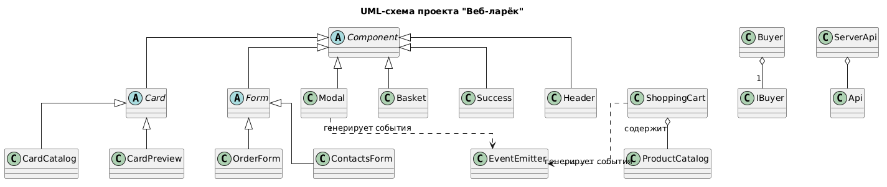

https://github.com/bbeeell/weblarek.git

# Проектная работа "Веб-ларек"

Стек: HTML, SCSS, TypeScript, Vite

Структура проекта:
- `src/` — исходные файлы проекта
- `src/components/` — папка с компонентами
- `src/components/base/` — папка с базовым кодом
- `src/components/models/` — папка с моделями данных
- `src/components/view/` — папка с классами представлений
- `src/components/communication/` — папка с коммуникационным слоем

Важные файлы:
- `index.html` — HTML-файл главной страницы
- `src/types/index.ts` — файл с типами
- `src/main.ts` — точка входа приложения (Презентер)
- `src/scss/styles.scss` — корневой файл стилей
- `src/utils/constants.ts` — файл с константами
- `src/utils/utils.ts` — файл с утилитами

## Установка и запуск

Для установки и запуска проекта необходимо выполнить команды:

```
npm install
npm run start
```

или

```
yarn
yarn start
```
## Сборка

```
npm run build
```

или

```
yarn build
```


# Интернет-магазин «Web-Larёk»

«Web-Larёk» — это интернет-магазин с товарами для веб-разработчиков, где пользователи могут просматривать товары, добавлять их в корзину и оформлять заказы. Сайт предоставляет удобный интерфейс с модальными окнами для просмотра деталей товаров, управления корзиной и выбора способа оплаты, обеспечивая полный цикл покупки с отправкой заказов на сервер.

---

## Архитектура приложения

Код приложения разделен на слои согласно парадигме **MVP (Model-View-Presenter)**:

- **Model** — слой данных. Отвечает за хранение и изменение данных (классы `ProductCatalog`, `ShoppingCart`, `Buyer`).
- **View** — слой представления. Отвечает за отображение данных на странице (классы, наследуемые от `Component`).
- **Presenter** — содержит основную логику приложения и реализован непосредственно в `main.ts`. Отвечает за связь представления и данных.

Взаимодействие между классами реализуется через события (`EventEmitter`). Модели и представления генерируют события при изменении данных или действиях пользователя, а Презентер обрабатывает их и связывает слои.

---

## Базовый код

### Класс `Component<T>`

Базовый абстрактный класс для всех компонентов интерфейса. Является дженериком.

**Конструктор**:
`constructor(container: HTMLElement)` — принимает корневой DOM-элемент компонента.

**Поля**:
- `container: HTMLElement` — корневой DOM-элемент.

**Методы**:
- `render(data?: Partial<T>): HTMLElement` — принимает данные для отображения, записывает их в поля и возвращает контейнер.
- `setImage(element: HTMLImageElement, src: string, alt?: string): void` — устанавливает изображение в ``.
- `toggleClass(element: HTMLElement, className: string, force?: boolean): void` — переключает CSS-класс.
- `setText(element: HTMLElement, value: string): void` — устанавливает текстовое содержимое элемента.
- `setDisabled(element: HTMLElement, state: boolean): void` — управляет атрибутом `disabled`.

### Класс `Api`

Содержит базовую логику для отправки HTTP-запросов.

**Конструктор**:
`constructor(baseUrl: string, options: RequestInit = {})`

**Поля**:
- `baseUrl: string` — базовый адрес сервера.
- `options: RequestInit` — заголовки запросов.

**Методы**:
- `get(uri: string): Promise<object>` — выполняет GET-запрос.
- `post(uri: string, data: object, method: ApiPostMethods = 'POST'): Promise<object>` — выполняет POST-запрос.

### Класс `EventEmitter`

Реализует паттерн «Наблюдатель» для связи слоев.

**Конструктор**:
`constructor()` — без параметров.

**Поля**:
- `_events: Map<EventName, Set<Function>>` — хранилище подписчиков.

**Методы**:
- `on(event: EventName, callback: Function): void` — подписка на событие.
- `emit(event: string, data?: T): void` — инициализация события.
- `trigger(event: string, context?: Partial<T>): Function` — возвращает функцию-триггер.

---

## Модели данных

### Интерфейс `IProduct`

Описывает структуру товара.

**Поля**:
- `id: string` — уникальный идентификатор.
- `title: string` — название.
- `description: string` — описание.
- `image: string` — путь к изображению.
- `category: string` — категория.
- `price: number | null` — цена (может быть `null`).

### Интерфейс `IBuyer`

Описывает данные покупателя.

**Поля**:
- `payment: TPayment` — способ оплаты (`'card' | 'cash' | ''`).
- `address: string` — адрес доставки.
- `email: string` — электронная почта.
- `phone: string` — номер телефона.

---

## Модели данных (Слой Model)

### Класс `ProductCatalog`

Хранит список товаров и выбранный для просмотра товар.

**Конструктор**:
`constructor()` — инициализирует пустой массив.

**Поля**:
- `protected products: IProduct[]` — все товары.
- `protected selectedProduct: IProduct | null` — выбранный товар.

**Методы**:
- `saveProducts(products: IProduct[]): void` — сохраняет список товаров.
- `getProducts(): IProduct[]` — возвращает все товары.
- `getProductByID(id: string): IProduct | undefined` — находит товар по ID.
- `saveProduct(product: IProduct): void` — сохраняет выбранный товар.
- `getProduct(): IProduct | null` — возвращает выбранный товар.

### Класс `ShoppingCart`

Управляет корзиной товаров.

**Конструктор**:
`constructor(events: IEvents)` — принимает брокер событий.

**Поля**:
- `protected storedItems: IProduct[]` — товары в корзине.
- `protected eventBus: IEvents` — брокер событий.

**Методы**:
- `retrieveAllItems(): IProduct[]` — возвращает все товары.
- `pushItem(newItem: IProduct): void` — добавляет товар (проверяет дубликаты, генерирует `cart:item-added`).
- `discardItem(targetId: string): void` — удаляет товар (генерирует `cart:item-removed`).
- `resetCart(): void` — очищает корзину (генерирует `cart:cleared`).
- `evaluateTotalPrice(): number` — вычисляет общую сумму.
- `countItems(): number` — возвращает количество товаров.
- `verifyItemExistence(itemId: string): boolean` — проверяет наличие товара.

### Класс `Buyer`

Хранит и валидирует данные покупателя.

**Конструктор**:
`constructor()` — инициализирует поля пустыми значениями.

**Поля**:
- `protected _payment: TPayment` — способ оплаты.
- `protected _address: string` — адрес.
- `protected _email: string` — email.
- `protected _phone: string` — телефон.

**Методы**:
- `setPayment(payment: TPayment): void` — устанавливает способ оплаты.
- `setAddress(address: string): void` — устанавливает адрес.
- `setEmail(email: string): void` — устанавливает email.
- `setPhone(phone: string): void` — устанавливает телефон.
- `getData(): IBuyer` — возвращает объект с данными.
- `resetProfile(): void` — очищает все поля.
- `validateFields(): Partial<Record<keyof IBuyer, string>>` — валидирует поля, возвращает ошибки.

---

## Слой коммуникации

### Класс `ServerApi`

Выполняет запросы к серверу через `Api`.

**Конструктор**:
`constructor(apiService: IApi)` — принимает объект для запросов.

**Поля**:
- `protected requester: IApi` — объект для HTTP-запросов.

**Методы**:
- `requestProductCatalog(): Promise<IProductList>` — запрашивает список товаров (`/product`).
- `submitOrder(payload: IOrderData): Promise<IOrderResponse>` — отправляет заказ (`/order`).

---

## Слой представления (View)

### Класс `Card` (абстрактный)

Базовый класс для карточек товаров.

**Конструктор**:
`constructor(container: HTMLElement)`

**Поля**:
- `titleElement: HTMLElement`
- `priceElement: HTMLElement`

**Сеттеры**:
- `set title(value: string)` — название.
- `set price(value: number | null)` — цена (форматирует как «X синапсов» или «Бесценно»).

---

### Класс `CardCatalog`

Карточка товара для каталога.

**Конструктор**:
`constructor(container: HTMLElement, onClick?: () => void)`

**Поля**:
- `categoryElement: HTMLElement`
- `imageElement: HTMLImageElement`

**Сеттеры**:
- `set category(value: string)` — категория.
- `set image(value: string)` — изображение (через `CDN_URL`).

---

### Класс `CardPreview`

Карточка для модального окна с деталями товара.

**Конструктор**:
`constructor(container: HTMLElement, onButtonClick?: () => void)`

**Поля**:
- `descriptionElement: HTMLElement`
- `buttonElement: HTMLButtonElement`

**Сеттеры**:
- `set description(value: string)` — описание.
- `set buttonText(value: string)` — текст на кнопке.
- `set disabled(value: boolean)` — блокировка кнопки.

---

### Класс `CardBasket`

Карточка товара внутри корзины.

**Конструктор**:
`constructor(container: HTMLElement, events: IEvents)`

**Поля**:
- `indexElement: HTMLElement`
- `deleteButton: HTMLButtonElement`

**Сеттеры**:
- `set index(value: number)` — порядковый номер.

---

### Класс `Header`

Шапка сайта с кнопкой корзины и счетчиком.

**Конструктор**:
`constructor(container: HTMLElement, events: IEvents)`

**Поля**:
- `basketButton: HTMLButtonElement`
- `counterElement: HTMLElement`

**Сеттеры**:
- `set counter(value: number)` — обновляет счетчик.

---

### Класс `Modal`

Модальное окно для отображения контента.

**Конструктор**:
`constructor(container: HTMLElement, events: IEvents)`

**Поля**:
- `closeButton: HTMLButtonElement`
- `contentElement: HTMLElement`

**Методы**:
- `open(): void` — открывает окно.
- `close(): void` — закрывает окно.

**Сеттеры**:
- `set content(value: HTMLElement)` — меняет содержимое.

---

### Класс `Basket`

Отображает содержимое корзины.

**Конструктор**:
`constructor(container: HTMLElement, events: IEvents)`

**Поля**:
- `listElement: HTMLElement`
- `totalElement: HTMLElement`
- `orderButton: HTMLButtonElement`

**Сеттеры**:
- `set items(items: HTMLElement[])` — список товаров.
- `set total(value: number)` — общая стоимость.

---

### Класс `Form<T>` (абстрактный)

Базовый класс для форм.

**Конструктор**:
`constructor(container: HTMLFormElement, events: IEvents)`

**Поля**:
- `submitButton: HTMLButtonElement`
- `errorsContainer: HTMLElement`

**Сеттеры**:
- `set valid(value: boolean)` — активность кнопки отправки.
- `set errors(value: string)` — сообщение об ошибке.

**Методы**:
- `render(state: Partial<T> & { errors?: string }): HTMLElement` — рендерит форму с данными.

---

### Класс `OrderForm`

Форма заказа (выбор оплаты + адрес).

**Конструктор**:
`constructor(container: HTMLFormElement, events: IEvents)`

**Поля**:
- `paymentButtons: HTMLButtonElement[]`

**Сеттеры**:
- `set payment(value: string)` — выбирает способ оплаты.
- `set address(value: string)` — заполняет поле адреса.

---

### Класс `ContactsForm`

Форма контактов (email + телефон).

**Конструктор**:
`constructor(container: HTMLFormElement, events: IEvents)`

**Сеттеры**:
- `set email(value: string)` — заполняет email.
- `set phone(value: string)` — заполняет телефон.

---

### Класс `Success`

Сообщение об успешном заказе.

**Конструктор**:
`constructor(container: HTMLElement, onClose: () => void)`

**Поля**:
- `totalElement: HTMLElement`
- `closeButton: HTMLButtonElement`

**Сеттеры**:
- `set total(value: number)` — отображает сумму списания.

---

## События приложения

| Событие | Источник | Описание |
|---------|----------|----------|
| `shopping-cart:open` | `Header` | Открытие корзины |
| `cart:item-added`, `cart:item-removed`, `cart:cleared` | `ShoppingCart` | Изменение корзины |
| `card:selected` | `main.ts` | Выбор товара для просмотра |
| `order:open` | `Basket` | Открытие формы заказа |
| `order:changed` | `OrderForm` | Изменение данных заказа |
| `order:submit` | `OrderForm` | Переход к контактам |
| `contacts:changed` | `ContactsForm` | Изменение контактов |
| `contacts:submit` | `ContactsForm` | Отправка заказа на сервер |
| `modal:open`, `modal:close` | `Modal` | Открытие/закрытие модального окна |

---

## UML-схема архитектуры


